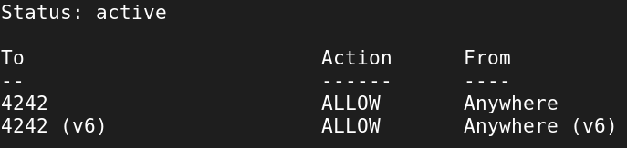
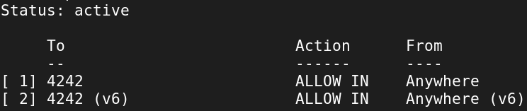

# Commands for Born2beroot

## SUDO
### UFW
__sudo apt install ufw__ : installation of UFW

__sudo ufw enable__ : Activation of ufw

__sudo ufw disable__ : Desactivation fo ufw

__sudo ufw status__ : check the current status of the Uncomplicated Firewall (UFW) on ubuntu and other debian-basde system.
* It displays whether UFW is active or inactive
* if active, it shows a list of current firewall rules

<div align="center">
	
</div><br>

__sudo ufw status numbered__ : Display the current status of the UFW firewall with the numbered rules.
* This command does the following :
	* Lists all active UFW rules
	* Assigns an order number to each rule
	* Displays details of each rule, including port, action and source/destination

<div align="center">
	
</div><br>

__sudo ufw allow \<port-id\>__ : Create a firewall rules that permit specific types of network traffic.<br>

__sudo ufw deny \<port-id\>__ : Create firewall rules that block specific types of network traffic.

__sudo ufw delete \<index\>__ : Remove an existing firewall rules in the Uncomplicated Firewall (UFW)

* Important considerations :
	* Rules numbers change after each delection, so always re-check the numbered list before deleting another rule.
	* To delete multiple rules, it's safer to delete them one by one, starting from the highest number to avoid renumbering issues.

__sudo ufw logging on__ : Enables logging fot the Uncomplicated Firewall

* It turns on the logging feature of UFW, which records firewall events.
* By default, it sets the logging level to "low"
* When logging is enabled, UFW will record events such as blocked packets and allowd connections.
* The logs are typically stored in /var/log/ufw.log

If you want to change the logging level, you can use the following commands :
* sudo ufw logging medium
* sudo ufw logging high
* sudo ufw logging full

__sudo ufw reload__ : Reload the UFW rules without disabling and re-enabling the firewall.

* It re-applies all existing firewall rules.
* It's useful after making changes to UFW rules, ensuring the new configurations take effect.
* Unlike the disable ans enable sequence, reload doesn't iterrupt the firewall's operation.

if successful you should see the output indicating that the rules have been reloaded.

It's important to note that while reload is usually enough, in some cases, such as after system updates or if you're experiencing issues, a full disable/enable cycle might be necessary.

### GROUPS

__sudo usermod -aG \<group\> \<user\>__ : Used to add an existing user to one or more supplementary groups without removing them from their current groups.

* The '-a' option stands for "append" and ensure that the user is added to the specified groups without being removed from their existing groups
* The '-G' option is used to specify the supplementary groups to which the user should be added.

You can add a user to multiple groups in a single command by separating the group names with commas
```
sudo usermod -aG group1,group2,group3 username
```

